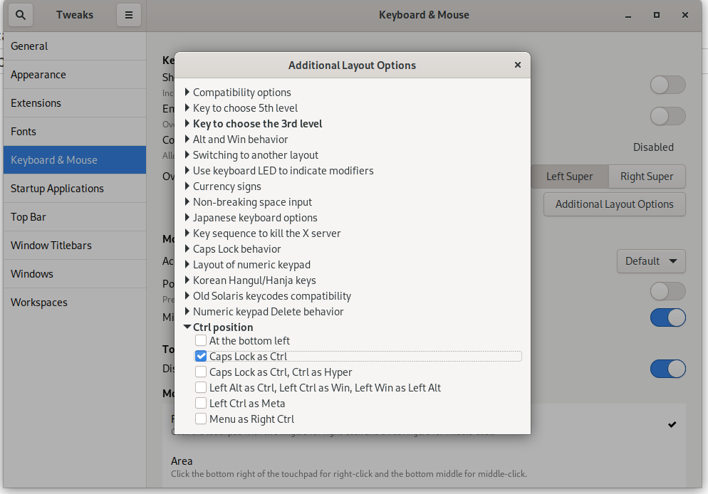
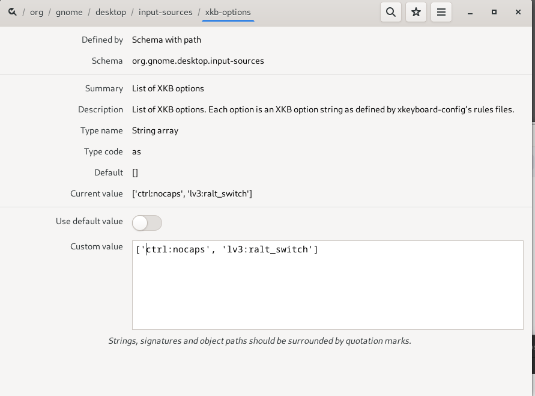
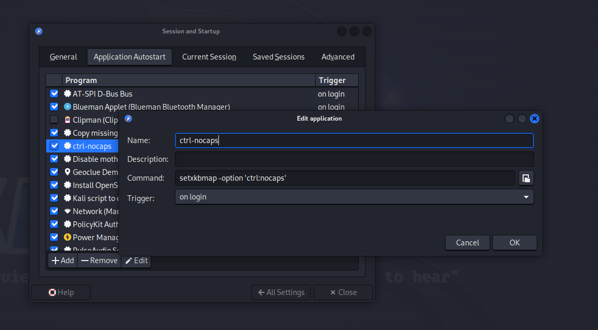

# Map Caps Lock to Ctrl

## Gnome Using Tweak Tool

{width=800}

## Gnome Using dconf-editor

{width=800}

## Xfce Using Settings Manager

Settings Manager -> Session and Startup -> Application Autostart

`setxkbmap -option 'ctrl:nocaps'`

creates an entry in $HOME/.config/autostart

{width=800}
